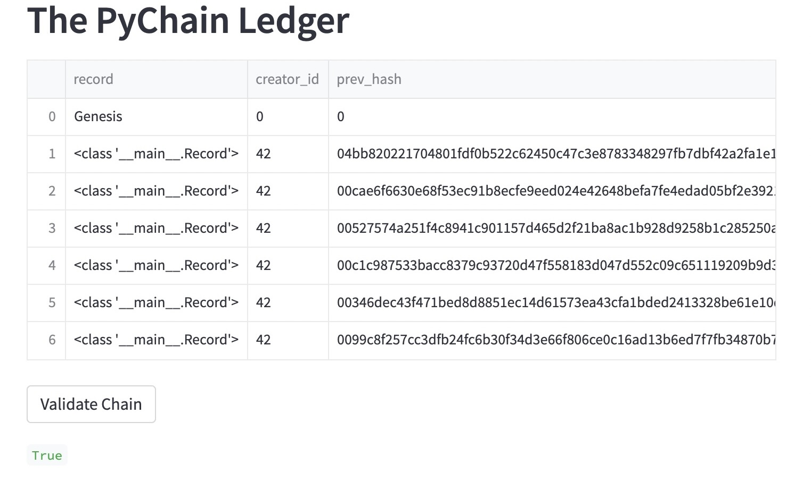

# PyChain

Blockchain-based ledger created using Python with a user-friendly web interface powered by Streamlit.

---

## Technologies

This project leverages Python with the following packages:

* [Pandas](https://github.com/pandas-dev/pandas) - For dataframes.

* [Streamlit](https://github.com/streamlit/streamlit) - For deploying app in browser.

---

## Installation Guide

Before first running the application install the following dependencies:

```python
    pip install pandas
    pip install streamlit
```

---

## Usage

To run the app, navigate to the directory containing `pychain.py` and run the following command:

```python
    streamlit run pychain.py
```

The program intakes user data for the sender, receiver, and amount and uses that data to create a block. As more are created, they are chained together using the previous hash and the blockchain can be validated to ensure it is correct. The sidebar contains a difficulty slider and an inspector that allows the user to look at information about individual blocks.

Below is an example of the web interface with the sidebar and blockchain in view:


As well as an image of the blockchain after being validated:



---

## Contributors

Brought to you by Majid Kouki. You can reach me at [majidkpy@gmail.com](mailto:majidkpy@gmail.com).

---

## License

[](https://opensource.org/licenses/MIT)